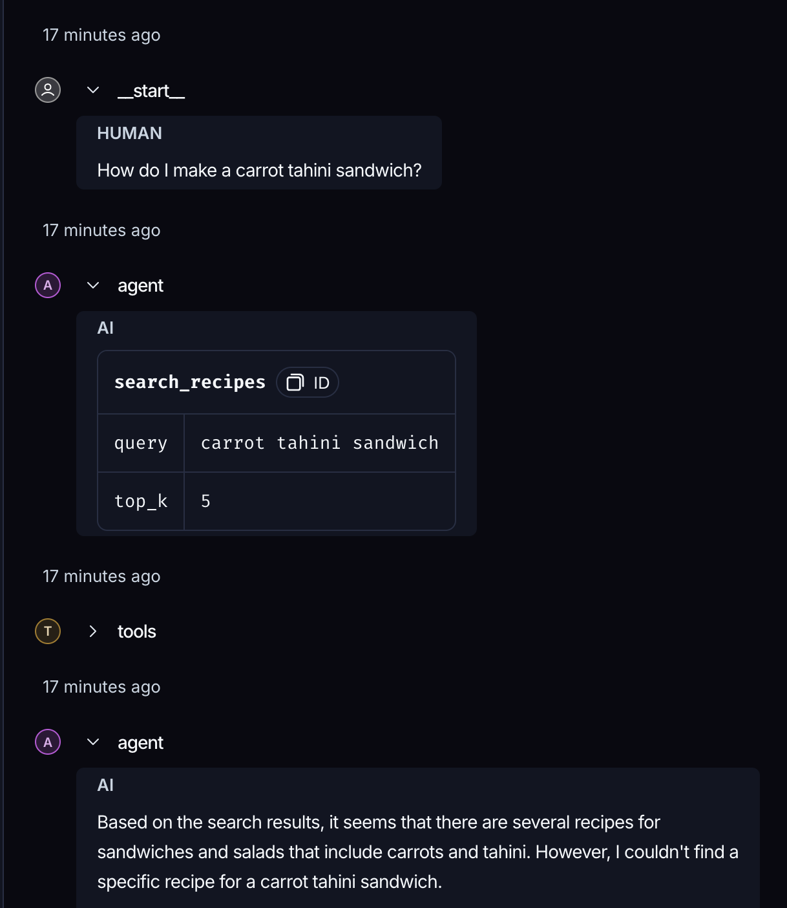
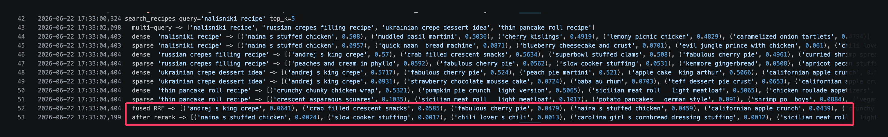

# Evaluation Results

## Setup

- **System under test:** the LangGraph ReAct agent (local Llama-3.1-8B via LM Studio)
  calling the recipe MCP server (4 tools + 1 resource) over `langchain-mcp-adapters`.
- **Corpus:** 500 recipes sampled from the Food.com dataset, indexed in Qdrant with
  BGE-M3 dense + sparse vectors.
- **Questions:** 10, in `test_queries.json`, covering semantic search, metadata
  filtering, nutrition/steps lookup, multi-step chains, and one out-of-corpus edge case.
- **Metrics:**
  - **Answer relevance** — manual 1–5 scoring of the agent's final (free-form)
    answer, against the answer relevance table below.
  - **Retrieval precision@k** — of the recipes returned by the search/filter tool,
    the fraction relevant to the request: `relevant_in_top_k / k`
    (judged manually from the `retrieved` field in `eval_output.md`).

### Answer relevance (1–5)

| Score | Meaning |
|:-----:|---------|
| **5** | Fully correct and useful — answers the question, grounded entirely in tool results. |
| **4** | Mostly correct — right recipes/answer, with one or two tangential or imprecise items. |
| **3** | Partially correct — addresses the request but misses part of it or mixes in irrelevant results. |
| **2** | Unhelpful — relevant data was retrieved but the answer fails to use it (e.g. doesn't return the requested steps). |
| **1** | Wrong or hallucinated — incorrect answer, or recipes invented that are not in the corpus. |

Free-form answers cannot be scored by exact match (the paraphrase problem), so this
is a human judge over a fixed scoring table.

## Per-question scores

| # | Question | Tool(s) used | Relevance | Retrieval P@k | Note |
|---|----------|--------------|:---------:|:-------------:|------|
| 1 | chicken + rice | search_recipes | 4 | 0.80 | 3/5 match both ingredients; "spicy steamed rice" (rice only) and "chicken and orzo salad" (no rice) are partial match |
| 2 | vegan <= 15 min | filter_recipes | 5 | 1.00 | exact metadata filter, all match |
| 3 | low-carb < 300 cal | filter_recipes | 5 | 1.00 | all within constraints |
| 4 | calories of banana walnut oatmeal | calculate_nutrition | 5 | 1.00 | exact-name lookup, correct |
| 5 | how to make carrot tahini sandwich | search_recipes | 2 | 1.00 | **failure 1** — retrieval found the exact recipe (P@k 1.0), but the agent didn't recognise it and never returned the steps |
| 6 | vegetarian beans dinner + how to cook | search_recipes + get_recipe_steps | 5 | 1.00 | correct multi-step chain |
| 7 | gluten-free dessert + nutrition | search_recipes + calculate_nutrition | 5 | 0.80 | correct dessert + nutrition; one retrieved item not a dessert |
| 8 | eggs/cheese/tomatoes breakfast | search_recipes | 4 | 0.80 | 4/5 fit the ingredients |
| 9 | healthy soup + cooking time | search_recipes | 5 | 1.00 | all soups; read `minutes` from metadata |
| 10 | nalisniki recipe (rare term) | search_recipes + get_recipe_steps | 2 | 0.00 | **failure 2** — reranker collapses on an unknown term, surfaces a wrong recipe, LLM presents it as nalisniki |

## Aggregate

- **Average answer relevance:** **4.2 / 5**
- **Average retrieval precision@k:** **0.84** (0.93 excluding the out-of-corpus Q10)
- 8 / 10 answers are fully grounded and useful; the 2 failures are analysed below.

The system reliably picks the right tool for clear-cut requests: exact `filter_recipes`
for hard constraints (Q2, Q3), `calculate_nutrition` / `get_recipe_steps` for named
recipes (Q4, Q6), and multi-step chains when the request needs them (Q6, Q7).

## Failure cases

### Failure 1 — agent fails to use a correct retrieval (Q5)

**Question:** *"How do I make a carrot tahini sandwich?"*
**What happened:** the agent called `search_recipes("carrot tahini sandwich")`, and
retrieval did its job perfectly — the exact recipe came back as result #1. But
the model then replied *"none of them exactly match"*, never recognised that the top hit
**was** the requested dish, and so never called `get_recipe_steps` to return the
instructions.

**Why:** The failure is that the model doesn't trust its own retrieval. It treats the
returned recipe as "not a match" instead of recognising it and chaining into
`get_recipe_steps`. (Possibly, the system prompt nudges this by framing `get_recipe_steps`
as something to use only *after* the user explicitly picks a recipe.) Hence relevance 2 —
"relevant data was retrieved but the answer fails to use it" — despite precision 1.0.

**Improvements:**
- Add a few-shot example of "request - retrieved top hit - chain into `get_recipe_steps`",
  so the model learns to act on a strong match instead of second-guessing it.

### Failure 2 — reranker collapses on a rare term, LLM trusts the wrong recipe (Q10)

**Question:** *"Find me a nalisniki recipe."* — *nalisniki* comes from Belarusian National cuisine, a term
outside the cross-encoder's vocabulary.

**What happened:** `search_recipes` ran the full pipeline, but the cross-encoder does not
recognise "nalisniki", so it scored *every* candidate near zero (top ≈ 0.0024) and its
ordering became arbitrary — it pushed *"naina's stuffed chicken"* to the top. The LLM
trusted that tool output, called `get_recipe_steps("naina's stuffed chicken")`, and
presented *that* dish's ingredients (chicken, mincemeat, potato, garam masala…) as the
ingredients for nalisniki.

**Why:** I believe, the scores for a term the reranker has never seen collapse to ~0 and their ordering becomes noise. As a result, it surfaces an
unrelated recipe as the best match, and the LLM has no way to know the tool returned
garbage — so it faithfully builds an answer on the wrong recipe. So the root cause here is the
tool returning an irrelevant result, not the model reasoning poorly.

**Improvements:**
- A relevance threshold on the cross-encoder score (now added in `rerank()` at
  `RERANK_MIN_SCORE = 0.03`): when every candidate scores near zero the tool returns nothing
  instead of a wrong recipe, so the LLM can say "no match" rather than hallucinate one.
- Fall back to the pre-rerank candidates when the reranker drops everything below the
  threshold: the multi-query expansion rephrases "nalisniki" into different queries, which the dense+sparse search fused by RRF can match to a real crepe — even when the cross-encoder can't score the rare term.
- Index a larger / more diverse corpus so more cuisines are actually covered.
