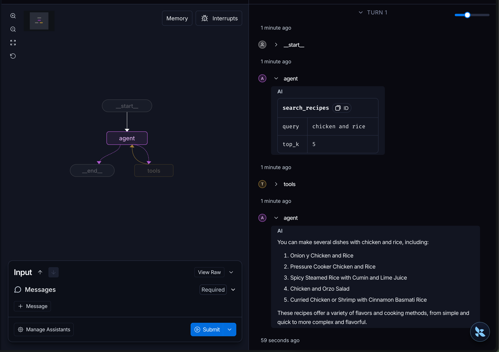
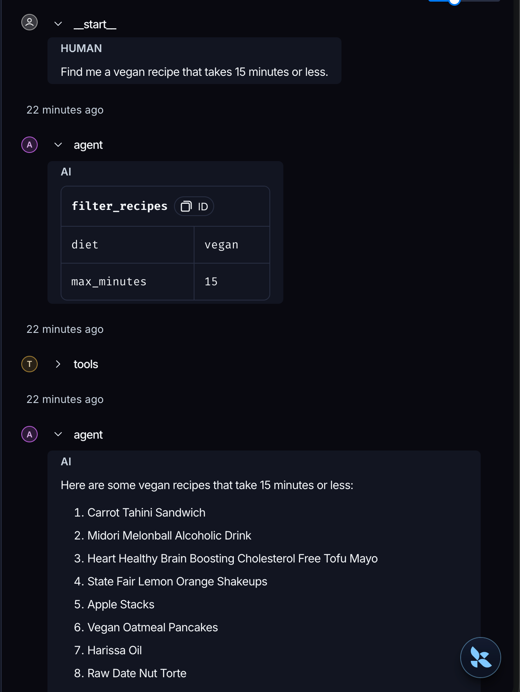
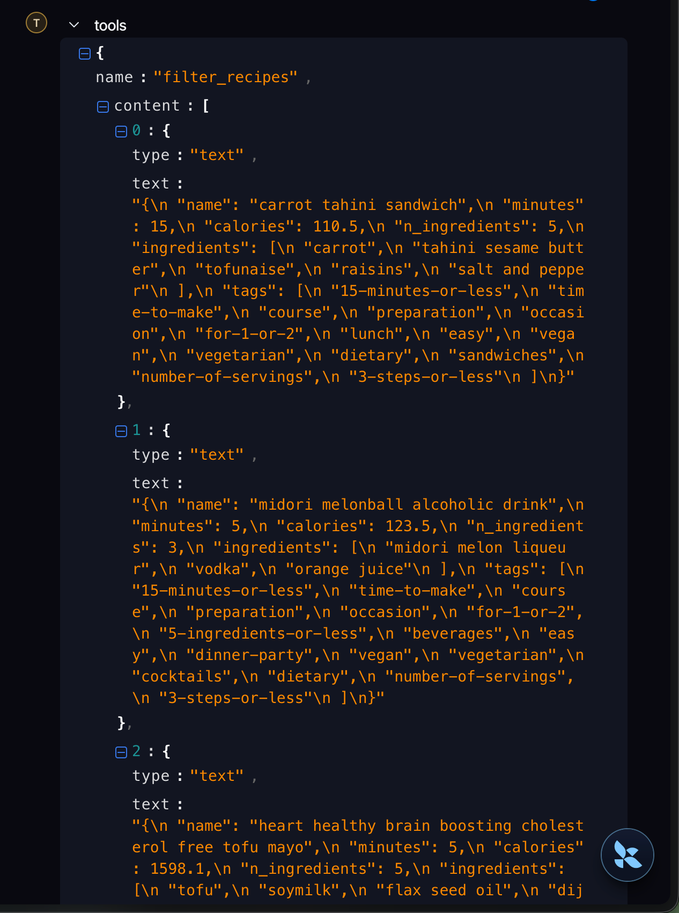
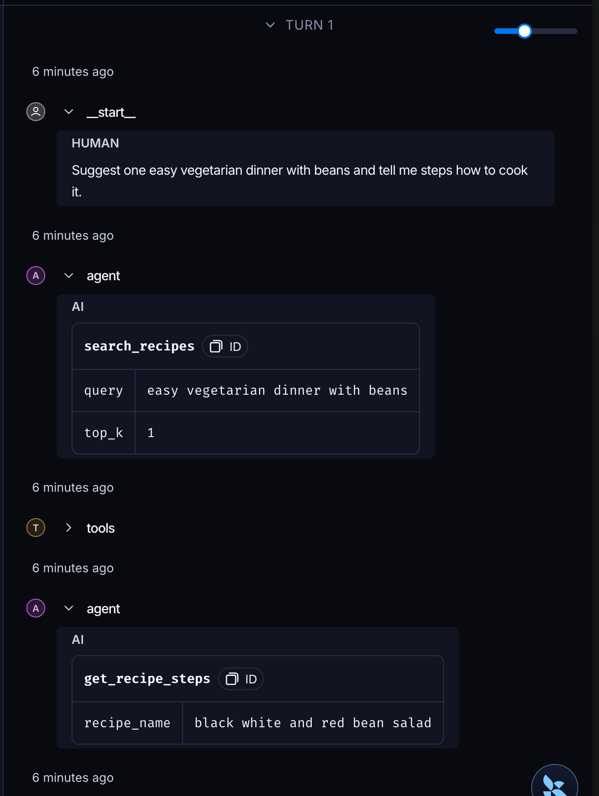
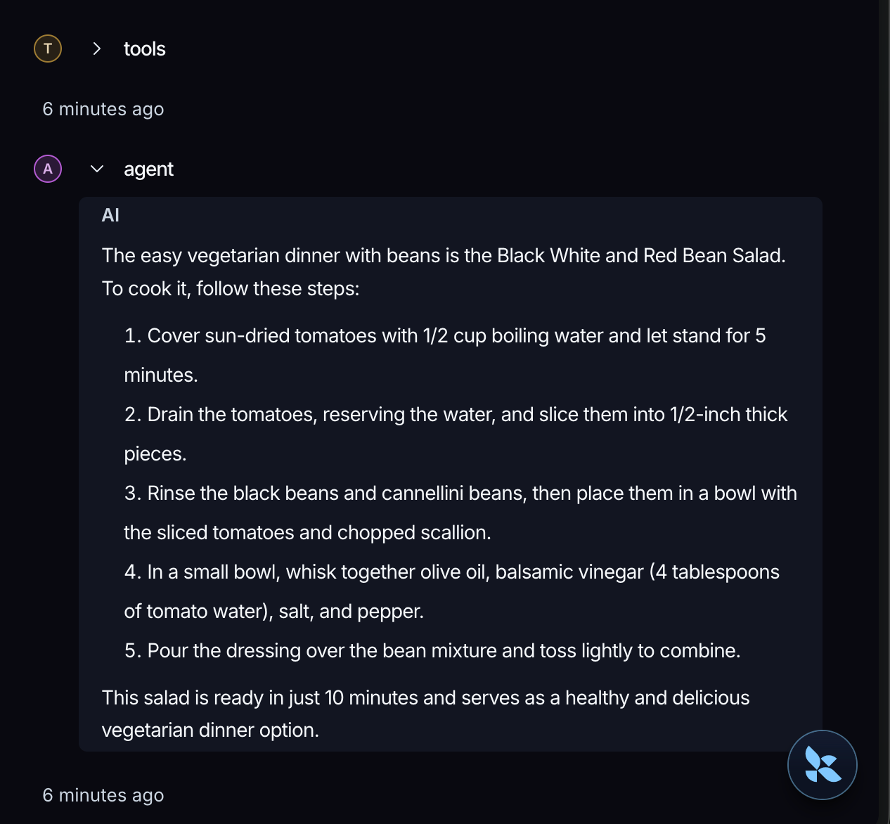

# Demo

## 1. Semantic search by ingredients (`search_recipes`)

Open-ended request: the agent reaches for vector search (multi-query + hybrid
dense/sparse + RRF + cross-encoder rerank).

**User:** What can I make with chicken and rice?

---

## 2. Metadata filtering (`filter_recipes`)

Hard constraints (a diet **and** a time budget) → the agent uses the exact
metadata filter instead of semantic search. `diet` is a closed enum, so the
small model picks a valid value (`vegan`) directly from the tool schema.

**User:** Find me a vegan recipe that takes 15 minutes or less.

*Capability: precise, constraint-satisfying filtering over payload metadata
(every result is tagged `vegan` and ≤ 15 minutes).*

---

## 3. Multi-step ReAct chain (`search_recipes` → `get_recipe_steps`)

A request that needs two steps: first find a dish, then fetch its instructions.
The agent loops — search, observe, then call a second tool with the exact recipe
name returned by the first.

**User:** Suggest one easy vegetarian dinner with beans and tell me steps how to cook it.

*Capability: the ReAct loop chains two tools, passing the exact recipe name from
the search result into `get_recipe_steps` (handled by the exact-name lookup).*
